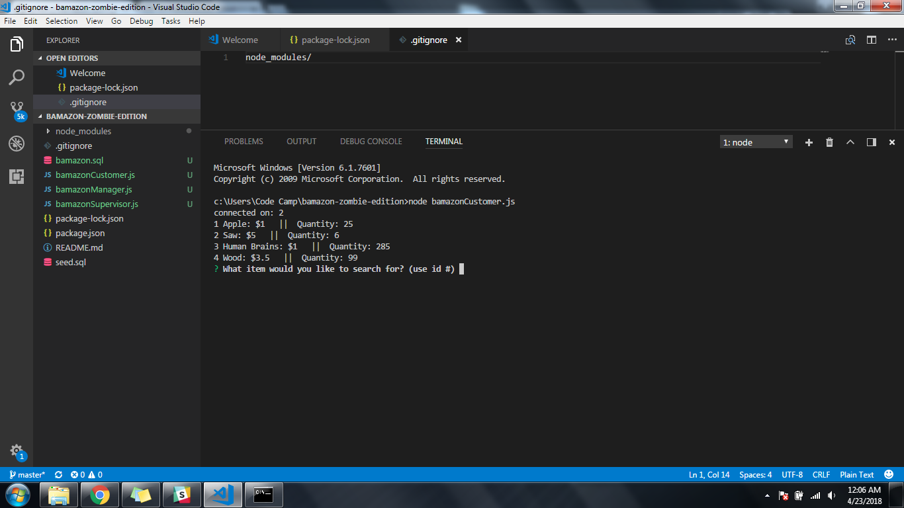
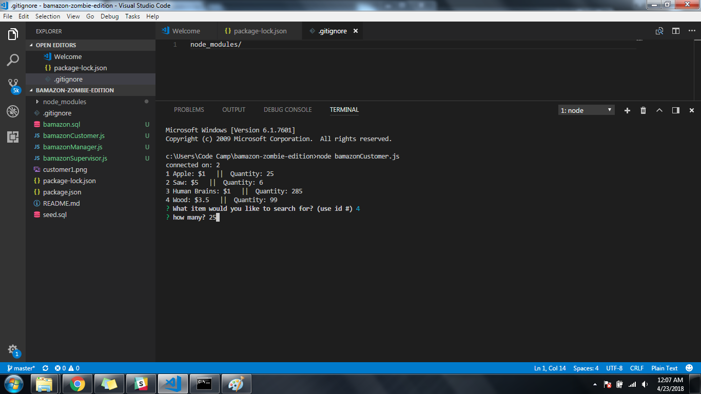
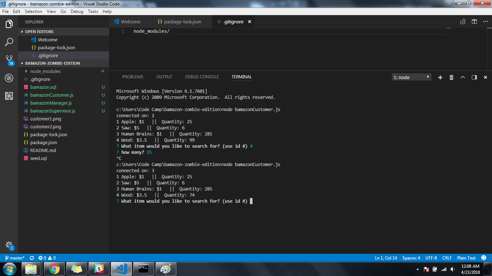
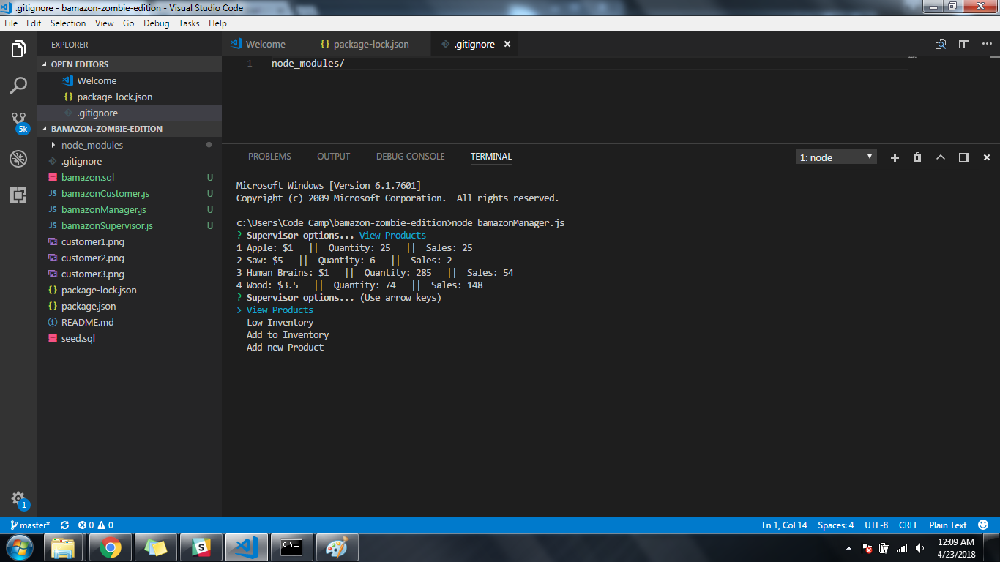
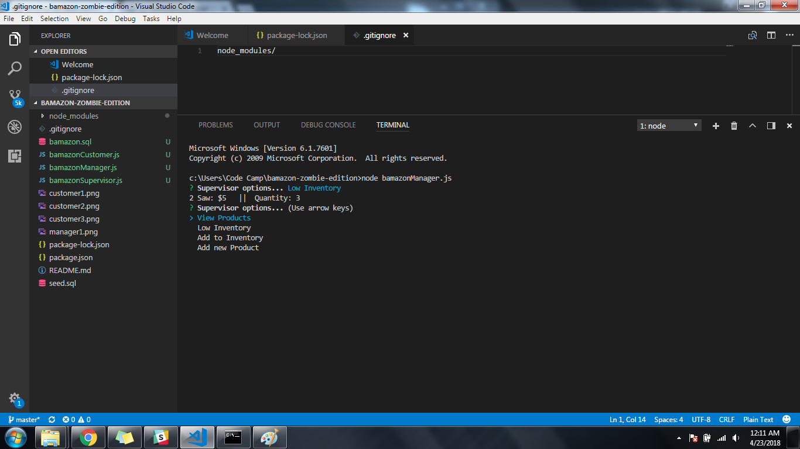
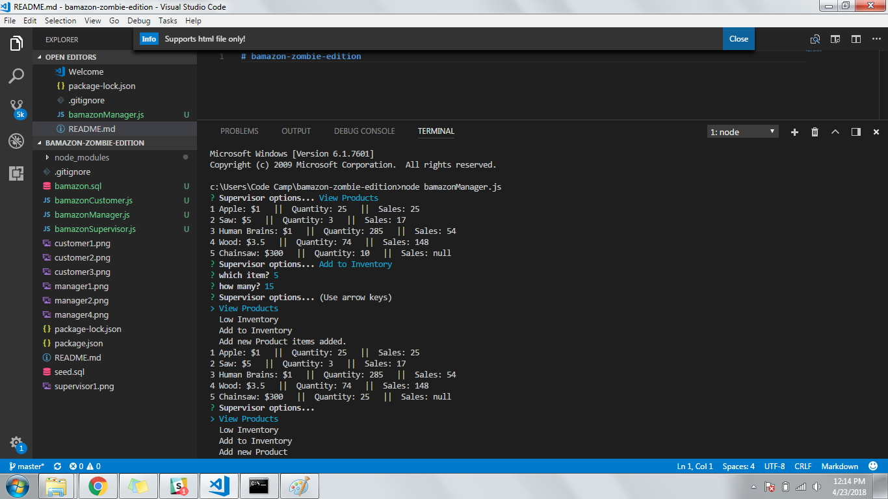
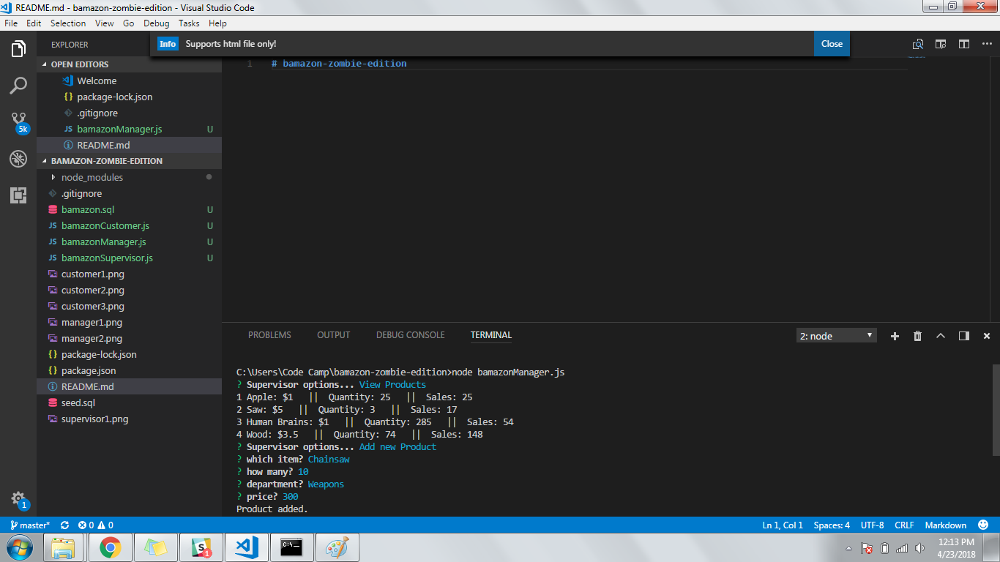
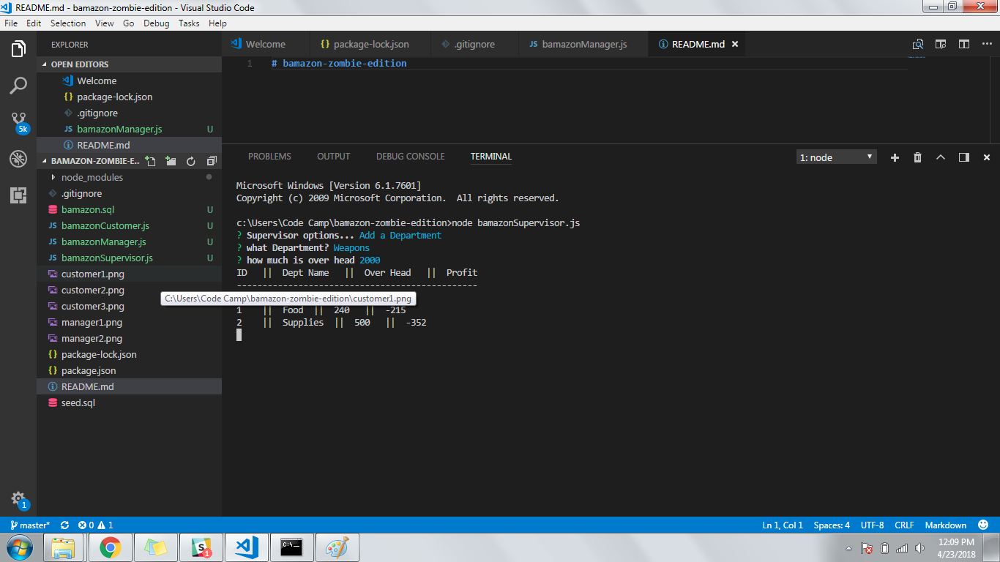
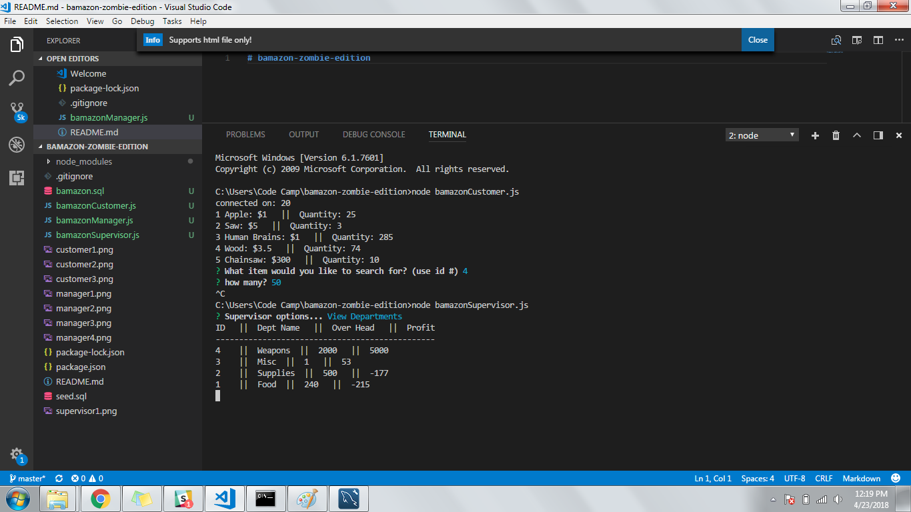

# bamazon-zombie-edition

description: A CLI based app that simulates a simplified amazon (with a zombie theme). To initialize run npm init and install inquirer, and mysql.

##For customers:

*enter which item you wich to buy based on the item_id on the table
*enter the amount of items you want to purchase

##For manager:

*using arrow keys select the option you want
*view inventory will display all items for sale
*low inventory will display all items with 5 or less units 
*add inventory will prompt to select item based on id and the amount to add to inventory
*add product adds a new product and prompts user to enter name, department name, quantity, and price

##for Supervisor:

*view departments wil display departments with sale values (ignoring depts with no sales)
*add department will add a new department and prompt user to enter department name and over head cost.

